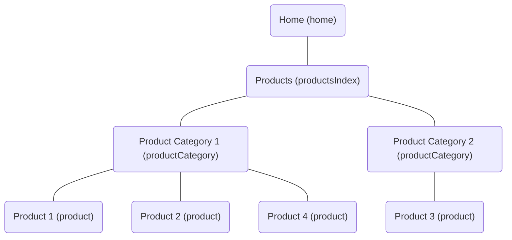

# Umbraco Invisible Nodes

[][build]
[][license]
[][nuget]

The package for Umbraco 8 and 10+ that hides nodes in the content tree making them 'invisible' to front end users.

Use this package to create logical groupings for nodes, where you want to exclude that grouping node from the generated URL.

Inspired by Sotiris Filippidis (DotSee)'s [VirtualNodes][virtualnodes] and [OmitSegmentsUrlProvider][omitsegments] packages.

## Example

Consider the following content tree, you know the Products have a unique name and they always will.
Using the Invisible Nodes package you can configure it to hide the Product Category document type.



Before the URL for Product 1 would be: `/products/product-category-1/product-1`.
After using and configuring Invisible Nodes package the URL would be: `/products/product-1`.

## Installation

Currently both Umbraco 8 and 10+ are supported.

### Umbraco 10+

```pwsh
dotnet add package Our.Umbraco.InvisibleNodes
```

### Umbraco 8

```pwsh
Install-Package Our.UmbracoCms.InvisibleNodes
```

## Usage

To make a node invisible, you can configure the app settings to make a content type an invisible node content type.

### Umbraco 10+

```json
{
  "InvisibleNodes": {
    "ContentTypes": [
      "hiddenNode"
    ]
  }
}
```

### Umbraco 8

```xml
<add key="InvisibleNodes" value="hiddenNode" />
```

## Contributing

Please raise any issues with the package on [GitHub][github].

## License

Copyright 2023 Luke Fisher

Licensed under the Apache License, Version 2.0 (the "License");
you may not use this file except in compliance with the License.
You may obtain a copy of the License at

http://www.apache.org/licenses/LICENSE-2.0

Unless required by applicable law or agreed to in writing, software
distributed under the License is distributed on an "AS IS" BASIS,
WITHOUT WARRANTIES OR CONDITIONS OF ANY KIND, either express or implied.
See the License for the specific language governing permissions and
limitations under the License.

[github]: https://github.com/ljfio/Umbraco-InvisibleNodes
[virtualnodes]: https://github.com/sotirisf/Umbraco-VirtualNodes
[omitsegments]: https://github.com/sotirisf/Umbraco-OmitSegmentsUrlProvider
[build]: https://github.com/ljfio/Umbraco-InvisibleNodes/actions/workflows/ci.yaml
[license]: https://github.com/ljfio/Umbraco-InvisibleNodes/blob/main/LICENSE
[nuget]: https://www.nuget.org/packages/Our.Umbraco.InvisibleNodes/